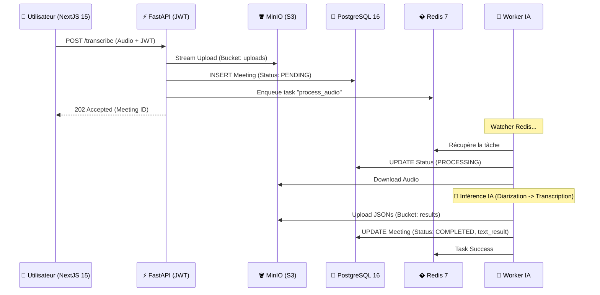

# 🏗️ Architecture Technique : Smart Meeting Scribe V5.0

> **Version** : 5.0 (Stack "Distribuée & S3-Ready")  
> **Approche** : "Micro-services", "Cloud Native" & "GPU Optimized"  
> **Cible** : Déploiement multi-conteneurs sur GPU unique (Consumer Grade - ex: RTX 4070 Ti)

Ce document sert de référence pour comprendre les choix technologiques, la gestion des flux de données et la stratégie de persistance validée pour 2026.

---

## 1. Vue d'Ensemble & Philosophie

La V5 marque le passage d'une gestion de fichiers locale à une architecture **Object Storage (S3)** et une **Clean Architecture** backend. Elle résout les problématiques de partage de données entre conteneurs et prépare l'intégration du RAG.

### Les 3 Piliers de l'Architecture V5

| Pilier | Description |
|--------|-------------|
| **Clean Architecture (BFF)** | Backend structuré en couches (Endpoints/Services/Models). Le Backend agit comme un Backend-for-Frontend (BFF) sécurisant l'accès aux données par JWT. |
| **Stockage S3 (MinIO)** | Migration vers l'API S3. Plus de volumes Docker complexes pour l'audio. L'API streame directement vers MinIO, et le Worker récupère les données via le réseau interne. |
| **Persistance Relationnelle** | Utilisation de PostgreSQL 16 pour gérer le cycle de vie complet des meetings et la banque de voix utilisateur. |

---

## 2. La Stack Technologique (Détail)

### 🌐 Couche Interface & Frontend

| Composant | Rôle | Technologie |
|-----------|------|-------------|
| **Frontend** | Interface utilisateur moderne & réactive | Next.js 15 (React 19 / App Router) |
| **Backend API** | Gateway sécurisée & Orchestrateur | FastAPI (Python 3.10) |

### ⚡ Couche Communication & Tâches

| Composant | Rôle | Performance |
|-----------|------|-------------|
| **Taskiq** | Orchestrateur asynchrone partagé entre API et Worker | Latence de queue < 5ms |
| **Redis 7** | Broker de messages pour Taskiq et cache temporaire | Mode persistant (AOF) |

### 🧠 Couche Intelligence (Worker IA)

| Modèle | Fonction | Notes |
|--------|----------|-------|
| **Faster-Whisper** | Transcription audio → texte | Modèle Large-v3 (Engine CTranslate2) |
| **Pyannote 3.1** | Diarisation ("Qui parle ?") | Optimisé pour le GPU avec vidage VRAM systématique |
| **WeSpeaker** | Identification biométrique | Extraction d'embeddings pour banque de voix |

### 💾 Couche Données (Persistence)

| Composant | Rôle | Technologie |
|-----------|------|-------------|
| **PostgreSQL 16** | Stockage structuré : Users, Meetings, Logs de tâches | SQLAlchemy Asyncpg (Driver haute performance) |
| **MinIO** | Stockage Objet (S3) : Audios bruts & Résultats JSON | Haute disponibilité, compatible API S3 standard |
| **Qdrant** | Base de données vectorielle | Prêt pour le RAG (Chat avec les réunions) |

---

## 3. Flux de Données (Workflow V5)

Voici le trajet d'une réunion au travers des micro-services.



---

## 4. Stratégie de Gestion GPU & VRAM

### Protocole de Sécurité CUDA V5

| Règle | Implémentation |
|-------|----------------|
| **Single Model Residency** | Un seul modèle (Whisper ou Pyannote) réside en VRAM à l'instant T. |
| **Hard Purge** | Après chaque phase : `torch.cuda.empty_cache()` + `gc.collect()`. |
| **Isolated Execution** | Le Worker tourne dans un processus dédié, isolé de l'API web pour éviter les crashs en cascade. |

---

## 5. Structure du Projet (Tree-view simplifié)

```
smart-meeting-scribe/
├── 01-core/                # INFRA (DB, Redis, S3, Qdrant)
├── 02-workers/             # COMPUTE (AI Engine)
│   ├── app/                # Services IA (Audio, Transcription, Diarization)
│   └── worker/             # Tasks Taskiq
├── 03-interface/           # ACCESS (Web Layer)
│   ├── backend/            # FastAPI (Auth JWT, S3 Services, SQL Models)
│   └── frontend/           # Next.js 15 (UI / Dashboard)
├── volumes/                # Persistance physique (S3, Postgres, Cache HF)
└── manage.sh               # Script Master (Reset & Start)
```

---

## 6. Évolutions (Roadmap V5+)

- **Next.js 15 Dashboard** : Visualisation riche des segments audio et édition du texte en temps réel.

- **RAG Integration** : Indexation automatique des transcriptions dans Qdrant pour poser des questions complexes sur l'historique des réunions.

- **Multi-Tenant** : Isolation stricte des données par utilisateur via le `user_id` en base de données.

---

> **Dernière mise à jour** : Janvier 2026
