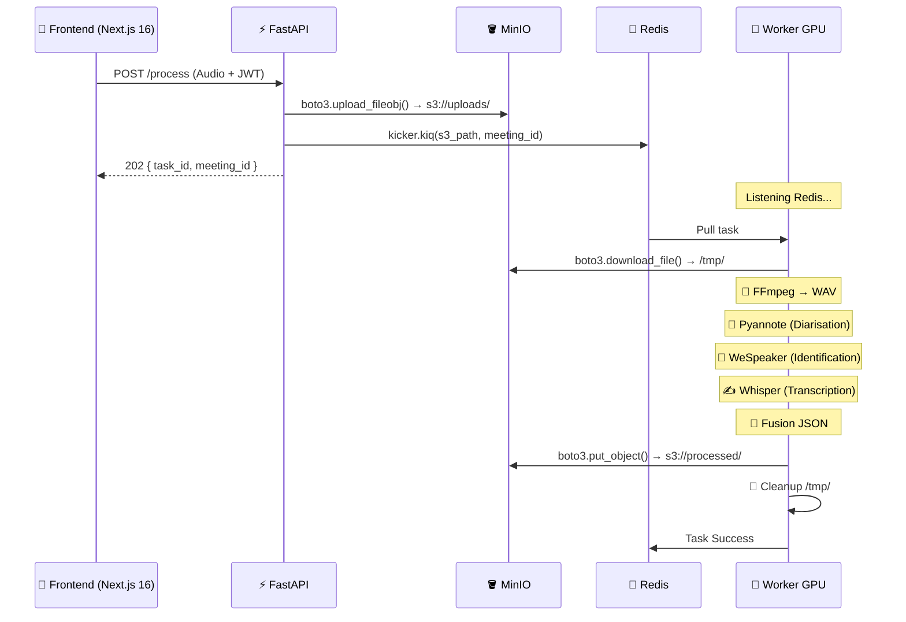

# 🏗️ Architecture Technique : Smart Meeting Scribe V5.1

> **Version** : 5.1 (Stack "Boto3 Native")  
> **Approche** : "Micro-services", "Cloud Native" & "GPU Optimized"  
> **Cible** : Déploiement multi-conteneurs sur GPU unique (Consumer Grade - ex: RTX 4070 Ti)

Ce document sert de référence pour comprendre les choix technologiques, la gestion des flux de données et la stratégie de persistance.

---

## 1. Vue d'Ensemble & Philosophie

La V5.1 consolide l'architecture **S3-Native** avec une migration complète vers **boto3** pour toutes les communications MinIO. Elle élimine les dépendances instables (fsspec/s3fs) tout en gardant une API simple.

### Les 4 Piliers de l'Architecture V5.1

| Pilier | Description |
|--------|-------------|
| **Clean Architecture** | Backend structuré en couches (Endpoints → Services → Models). BFF sécurisé par JWT. |
| **Boto3 Streaming** | Upload/Download S3 unifié via `boto3`. Pas de stockage intermédiaire sur disque. |
| **Persistance Relationnelle** | PostgreSQL 16 pour le cycle de vie des meetings et utilisateurs. |
| **GPU Safety** | Single Model Residency + Garbage Collection VRAM systématique. |

---

## 2. La Stack Technologique

### 🌐 Couche Interface

| Composant | Technologie | Notes |
|-----------|-------------|-------|
| **Frontend** | Next.js 16 (Standalone) | Image Docker optimisée (~100MB) |
| **API Gateway** | FastAPI + boto3 | Streaming direct vers MinIO |

### ⚡ Couche Communication

| Composant | Rôle | Technologie |
|-----------|------|-------------|
| **Taskiq** | Orchestrateur async API ↔ Worker | Python native |
| **Redis 7** | Broker de messages + Result Backend | Mode AOF |

### 🧠 Couche Intelligence (Worker GPU)

| Modèle | Fonction | Version |
|--------|----------|---------|
| **Faster-Whisper** | Transcription audio → texte | Large-v3-Turbo (CTranslate2) |
| **Pyannote 3.1** | Diarisation ("Qui parle ?") | speaker-diarization-3.1 |
| **WeSpeaker** | Identification biométrique | ResNet34-LM |

### 💾 Couche Données

| Composant | Rôle | Accès |
|-----------|------|-------|
| **PostgreSQL 16** | Users, Meetings, Metadata | asyncpg (SQLAlchemy) |
| **MinIO** | Audio (uploads) + Résultats (processed) | boto3 (S3 API) |
| **Qdrant** | Vecteurs (futur RAG) | REST API |
| **TEI** | Embeddings CPU | HuggingFace TGI |

---

## 3. Flux de Données (Workflow boto3)



---

## 4. Communication S3 (boto3)

### API Gateway (`transcribe.py`)

```python
# Upload streaming (pas de fichier local)
s3_client.upload_fileobj(
    file.file,                    # Stream HTTP entrant
    settings.MINIO_BUCKET_AUDIO,  # "uploads"
    object_name,
    ExtraArgs={"ContentType": file.content_type}
)
```

### Worker (`tasks.py`)

```python
# Download vers /tmp pour traitement GPU
s3.download_file(bucket_name, object_key, local_dest)
```

### Storage (`storage.py`)

```python
# Upload résultats JSON
s3.put_object(
    Bucket=settings.MINIO_BUCKET_RESULTS,  # "processed"
    Key=object_key,
    Body=json.dumps(data).encode('utf-8'),
    ContentType='application/json'
)
```

---

## 5. Stratégie GPU & VRAM

### Protocole Single Model Residency

| Phase | Modèle chargé | VRAM utilisée |
|-------|---------------|---------------|
| Diarisation | Pyannote 3.1 | ~1 GB |
| Identification | WeSpeaker (+ Pyannote) | ~2.6 GB |
| Transcription | Whisper Large-v3-Turbo | ~3.1 GB |

### Garbage Collection

```python
# Après chaque phase GPU
def release_models():
    for model in loaded_models.values():
        del model
    loaded_models.clear()
    gc.collect()
    torch.cuda.empty_cache()
```

---

## 6. Structure du Projet

```
smart-meeting-scribe/
├── 01-core/                     # INFRASTRUCTURE
│   └── docker-compose.yml       # PostgreSQL, Redis, MinIO, Qdrant, TEI
│
├── 02-workers/                  # COMPUTE (GPU)
│   ├── app/
│   │   ├── worker/tasks.py      # Pipeline principal (boto3)
│   │   ├── services/
│   │   │   ├── audio.py         # FFmpeg conversion
│   │   │   ├── diarization.py   # Pyannote
│   │   │   ├── transcription.py # Whisper
│   │   │   ├── identification.py# WeSpeaker
│   │   │   ├── fusion.py        # Merge segments
│   │   │   └── storage.py       # boto3 upload
│   │   └── core/models.py       # Gestion VRAM
│   ├── voice_bank/              # Signatures vocales
│   └── Dockerfile               # CUDA 12.4
│
├── 03-interface/                # WEB LAYER
│   ├── backend/                 # FastAPI
│   │   └── app/
│   │       ├── api/v1/          # Routes (auth, process)
│   │       ├── broker.py        # Taskiq Redis
│   │       └── core/config.py   # Settings boto3
│   └── frontend-nextjs/         # Next.js 16 (Standalone)
│
├── volumes/                     # Persistance
├── .env                         # Configuration
└── manage.sh                    # 🛠️ Script Master
```

---

## 7. Endpoints API

| Méthode | Route | Description |
|---------|-------|-------------|
| `POST` | `/api/v1/auth/register` | Inscription utilisateur |
| `POST` | `/api/v1/auth/login` | Connexion (retourne JWT) |
| `POST` | `/api/v1/process/` | Upload audio → dispatch task |
| `GET` | `/api/v1/process/status/{task_id}` | Statut de la transcription |

---

## 8. Variables d'Environnement

| Variable | Description |
|----------|-------------|
| `MINIO_ROOT_USER` | Credentials MinIO |
| `MINIO_ROOT_PASSWORD` | Credentials MinIO |
| `MINIO_ENDPOINT` | Adresse MinIO (ex: `minio:9000`) |
| `POSTGRES_USER/PASSWORD/DB` | Credentials PostgreSQL |
| `REDIS_URL` | URL Redis (ex: `redis://sms_redis:6379`) |
| `HF_TOKEN` | Token HuggingFace (modèles gated) |

---

## 9. Évolutions (Roadmap)

- [x] Migration fsspec → boto3
- [x] Next.js 16 Standalone Docker
- [x] Speaker Identification (WeSpeaker)
- [ ] Dashboard utilisateur (Next.js)
- [ ] RAG Integration (Qdrant + LLM)
- [ ] Export Word/PDF
- [ ] Multi-Tenant isolation

---

> **Dernière mise à jour** : 15 Janvier 2026
