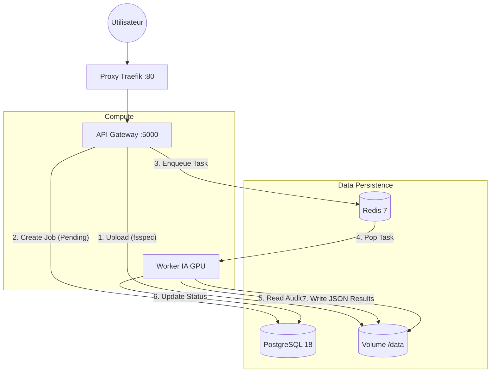

# Architecture Technique - Smart Meeting Scribe (V3.1)

> ⚠️ **WORK IN PROGRESS (WIP)**
> Ce projet est actuellement en phase de **construction active**. L'architecture et les endpoints peuvent évoluer.
> *Version actuelle : v3.1.0-alpha*

> 🤖 **IA - Application réunion** | *Gem personnalisé*

---

> 🚀 **VERSION V3.1 - Architecture Asynchrone & Micro-services**  
> Ce projet est une solution **Enterprise-Grade** d'analyse de réunions **100% On-Premise**.  
> Stack : **Docker** • **FastAPI** • **Taskiq (Redis)** • **PostgreSQL** • **Whisper/Pyannote**

---

## 🎯 Vision & Philosophie

**Smart Meeting Scribe** transforme des enregistrements audio en comptes-rendus structurés et identifiés, en garantissant une **confidentialité absolue**.

### Piliers de l'Architecture V3.1

| Pilier | Description |
|--------|-------------|
| 🔒 **Confidentialité "Air-Gap"** | Tout le traitement (IA) est local. Aucune donnée ne quitte le conteneur Docker. |
| ⚡ **Design Asynchrone (Fire & Forget)** | L'API ne bloque jamais. Elle reçoit la demande, la sécurise et délègue le calcul lourd à un Worker dédié via une file d'attente (Redis). |
| 🎮 **GPU Safety (VRAM Saver)** | Stratégie stricte d'allocation mémoire pour tourner sur des GPU "Consumer" (RTX 4070 Ti - 12GB) sans crash, grâce au chargement/déchargement dynamique des modèles. |
| 💾 **Agnostique du Stockage** | Utilisation de `fsspec` pour abstraire le système de fichiers (Compatible Local FS aujourd'hui, S3/MinIO demain sans changer le code). |

---

## 🏗️ Architecture Système (Stack Docker)

L'application est orchestrée via **Docker Compose** et sépare strictement les responsabilités.

### Vue d'ensemble des Conteneurs



### Composants Techniques

| Service | Technologie | Rôle |
|---------|-------------|------|
| **Proxy** | Traefik V3 | Point d'entrée unique, Routing, Load Balancing. |
| **API** | FastAPI | Gateway légère. Validation des entrées, Upload, Gestion de la DB. |
| **Broker** | Redis 7 | File d'attente de messages. Fait le lien entre API et Worker. |
| **Worker** | Taskiq + Python | Exécute le pipeline IA lourd. Accès exclusif au GPU. |
| **Database** | PostgreSQL 18 | "Mémoire" du système. Stocke les métadonnées, statuts des jobs, utilisateurs. |
| **Storage** | fsspec | Abstraction du stockage (fichiers audio & résultats JSON). |

---

## 🔄 Pipeline de Traitement (Workflow IA)

Le traitement suit un cycle de vie strict suivi en base de données (table `meetings`).

### 1. Réception (API)
- Upload du fichier via `fsspec` ➔ `/data/uploads/uuid.wav`
- Création entrée DB ➔ Statut `PENDING`
- Envoi tâche au Broker

### 2. Prise en Charge (Worker)
- Récupération tâche Redis
- Mise à jour DB ➔ Statut `PROCESSING`

### 3. Pipeline IA Séquentiel (Optimisation VRAM)

```
┌─────────────────────────────────────────────────────────────┐
│  1. Conversion       │  Normalisation audio (WAV 16kHz Mono)│
└──────────────────────┴──────────────────────────────────────┘
                       │
                       ▼
┌─────────────────────────────────────────────────────────────┐
│  2. Diarisation      │  Pyannote 3.1 - "Qui parle ?"       │
│     (Pyannote 3.1)   │  Segmentation temporelle             │
└──────────────────────┴──────────────────────────────────────┘
                       │ 🧹 Flush VRAM
                       ▼
┌─────────────────────────────────────────────────────────────┐
│  3. Identification   │  WeSpeaker - Comparaison vectorielle │
│     (WeSpeaker)      │  avec la Banque de Voix              │
└──────────────────────┴──────────────────────────────────────┘
                       │ 🧹 Flush VRAM
                       ▼
┌─────────────────────────────────────────────────────────────┐
│  4. Transcription    │  Faster-Whisper Large-v3             │
│     (Faster-Whisper) │  Speech-to-Text                      │
└──────────────────────┴──────────────────────────────────────┘
                       │ 🧹 Flush VRAM
                       ▼
┌─────────────────────────────────────────────────────────────┐
│  5. Fusion           │  Réconciliation segments + texte     │
└──────────────────────┴──────────────────────────────────────┘
```

### 4. Finalisation
- Sauvegarde des JSONs (Transcription, Diarisation, Fusion) via `fsspec`
- Mise à jour DB ➔ Statut `COMPLETED` + Chemins des résultats + Durée calcul

---

## 📂 Structure du Projet

Le backend est un **monolithe modulaire** (API et Worker partagent le même code mais s'exécutent séparément).

```bash
smart-meeting-scribe/
├── docker-compose.yml       # Orchestration complète
├── backend-python/
│   ├── Dockerfile           # Environnement unifié (Cuda 12.4)
│   ├── requirements.txt     # Dépendances (Torch, Asyncpg, Taskiq...)
│   └── app/
│       ├── main.py          # Entrée API (FastAPI)
│       ├── broker.py        # Config Taskiq (Redis)
│       ├── core/
│       │   ├── config.py    # Vars d'env
│       │   ├── database.py  # Connexion Postgres (SQLAlchemy Async)
│       │   └── models_db.py # Schémas des tables SQL
│       ├── services/
│       │   ├── storage.py   # 💾 Abstraction fsspec (Local/S3)
│       │   ├── audio.py     # Traitement Audio
│       │   ├── transcription.py # Whisper
│       │   └── ...
│       ├── api/             # Routes HTTP
│       └── worker/
│           └── tasks.py     # 👷 Logique du Worker (Pipeline IA)
├── data_shared/             # Volume partagé (uploads, résultats)
│   ├── uploads/             # Fichiers audio bruts
│   └── results/             # 📁 JSON finaux par date/meeting_id
└── frontend-nextjs/         # Interface utilisateur (à venir)
```

---

## 🚀 Installation & Démarrage

### Pré-requis

- **Docker** & **Docker Compose**
- **Drivers NVIDIA** & **NVIDIA Container Toolkit** installés sur l'hôte

### Commandes

```bash
# 1. Construire et lancer la stack
docker compose up -d --build

# 2. Vérifier les logs du Worker (Pour voir l'IA travailler)
docker compose logs -f worker

# 3. Arrêter la stack proprement
docker compose down
```

### Accès aux Services

| Service | URL |
|---------|-----|
| **API Swagger** | http://localhost/docs |
| **Administration DB** | Via pgAdmin (local) sur le port `5432` (User: `user` / Pass: `password`) |
| **Traefik Dashboard** | http://localhost:8080 |

---

## 💾 Gestion des Données (Persistance)

Deux volumes Docker assurent la pérennité des données :

| Volume | Chemin Conteneur | Description |
|--------|------------------|-------------|
| `postgres_data` | - | Base de données SQL (ne jamais supprimer sauf reset total) |
| `./data_shared` | `/data` | Stockage des fichiers |

### Structure du dossier `/data`

```
/data/
├── uploads/              # Fichiers audio bruts uploadés
└── results/              # � Résultats JSON structurés
    └── YYYYMMDD/         # Par date (ex: 20260111)
        └── <meeting_id>/ # Par réunion (UUID)
            ├── transcription.json
            ├── diarization.json
            └── fusion.json    # ⭐ JSON final fusionné
```

---

## ⚡ Stratégie d'Optimisation VRAM

Pour tourner sur des GPU grand public (ex: RTX 4070 Ti - 12GB), nous appliquons une stratégie stricte de **Single Model Residency** :

1. ✅ Chargement du modèle A
2. ⚙️ Inférence (Calcul)
3. 🧹 Déchargement explicite :
   - Suppression des pointeurs Python
   - Appel du Garbage Collector (`gc.collect()`)
   - Vidage du cache CUDA (`torch.cuda.empty_cache()`)
4. ✅ Chargement du modèle B

Ceci permet d'utiliser des modèles lourds (Whisper Large-v3 + Pyannote 3.1) sans provoquer d'erreurs **Out Of Memory (OOM)**.

---

## 📋 Roadmap

- [ ] Frontend NextJS avec visualisation des transcriptions
- [ ] Export PDF des comptes-rendus
- [ ] Résumé automatique via LLM local
- [ ] Support multi-langues
- [ ] Intégration S3/MinIO pour le stockage cloud

---

*Dernière mise à jour : Janvier 2026*
