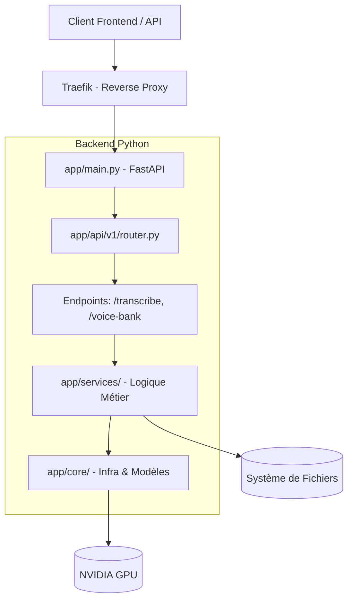

# Architecture Technique - Smart Meeting Scribe

## 📚 Vue d'ensemble

L'application repose sur une architecture modulaire de type **Clean Architecture**, conçue pour être déployée via **Docker**. Le code applicatif est isolé dans le module `app/`, séparant clairement la logique métier, l'API et l'infrastructure.

### Structure en Couches



## 🔄 Pipeline de Traitement Audio

Le traitement d'une réunion suit un flux séquentiel strict pour optimiser l'utilisation de la VRAM (mémoire vidéo).

```
Fichier Audio (Upload)
         │
         ▼
┌─────────────────────────┐
│  POST /api/v1/process/  │  ◄── app/api/v1/endpoints/transcribe.py
└─────────────────────────┘
         │
         ▼
┌─────────────────────────┐
│ 1. Audio Conversion     │  app/services/audio.py
│    (FFmpeg)             │  ➔ Conversion en WAV mono 16kHz
└─────────────────────────┘
         │
         ▼
┌─────────────────────────┐
│ 2. Diarisation          │  app/services/diarization.py
│    (Pyannote 3.1)       │  ➔ "Qui parle quand ?" (Segments temporels)
└─────────────────────────┘
         │ 🧹 release_models() (Libération VRAM)
         ▼
┌─────────────────────────┐
│ 3. Identification       │  app/services/identification.py
│    (WeSpeaker)          │  ➔ Comparaison avec voice_bank/
│                         │  ➔ SPEAKER_01 = "Emmanuel"
└─────────────────────────┘
         │ 🧹 release_models()
         ▼
┌─────────────────────────┐
│ 4. Transcription        │  app/services/transcription.py
│    (Faster-Whisper)     │  ➔ Speech-to-Text avec timestamps
└─────────────────────────┘
         │ 🧹 release_models()
         ▼
┌─────────────────────────┐
│ 5. Fusion & Stockage    │  app/services/fusion.py & storage.py
│                         │  ➔ Création du JSON final
└─────────────────────────┘
         │
         ▼
    { JSON Response }
```

## 📂 Organisation du Code

L'application est contenue dans le dossier `app/` pour faciliter les imports et la conteneurisation.

### 1. Point d'entrée & Configuration

- **app/main.py** : Point d'entrée de l'application FastAPI. Configure les middlewares, le CORS et monte les routes.

- **app/core/config.py** : Gestion centralisée de la configuration. Charge les variables d'environnement (ex: `HF_TOKEN`) et détecte le matériel (CPU/GPU).

- **app/core/models.py** : Gestionnaire de cycle de vie des modèles IA. Implémente le chargement paresseux (lazy loading) et le nettoyage de la mémoire GPU (`release_models`).

### 2. API (Couche Transport)

- **app/api/v1/router.py** : Hub central déclarant toutes les routes de l'API.

- **app/api/v1/endpoints/transcribe.py** : Chef d'orchestre du pipeline. Reçoit le fichier et appelle séquentiellement les services.

- **app/api/v1/endpoints/voice_bank.py** : Gestion des signatures vocales (ajout/suppression de voix de référence).

### 3. Services (Couche Métier)

- **app/services/audio.py** : Manipulation audio (conversion, normalisation, nettoyage fichiers temporaires).

- **app/services/diarization.py** : Wrapper autour de Pyannote 3.1. Découpe l'audio par locuteur.

- **app/services/transcription.py** : Wrapper autour de Faster-Whisper. Transcrit l'audio en texte.

- **app/services/identification.py** : Moteur de reconnaissance. Compare les segments audio aux empreintes de la voice_bank (Cosine Similarity).

- **app/services/fusion.py** : Algorithme de réconciliation. Associe le texte (Whisper) aux locuteurs identifiés (Pyannote + Identification).

- **app/services/storage.py** : Gestion de la persistance. Sauvegarde les résultats JSON dans le volume `recordings/`.

## 🔌 API Endpoints

| Méthode | Route | Description |
|---------|-------|-------------|
| GET | `/` | Health Check. Retourne l'état du service et les infos GPU. |
| GET | `/docs` | Documentation interactive Swagger UI. |
| POST | `/api/v1/process/` | Transcription. Upload d'un fichier audio pour analyse complète. |
| GET | `/api/v1/voice-bank/` | Liste les profils vocaux disponibles. |

## 💾 Gestion des Données & Volumes

L'application utilise des volumes Docker pour la persistance des données :

- **/code/recordings** : Stocke les résultats d'analyse (JSON, logs).
  - Monté sur l'hôte : `./backend-python/recordings`

- **/code/voice_bank** : Contient les empreintes vocales de référence (fichiers `.wav` ou `.npy`).
  - Monté sur l'hôte : `./backend-python/voice_bank`

## ⚡ Stratégie d'Optimisation VRAM

Pour tourner sur des GPU grand public (ex: RTX 4070 Ti - 12GB), nous appliquons une stratégie stricte de **Single Model Residency** :

1. Chargement du modèle A.
2. Inférence (Calcul).
3. Déchargement explicite :
   - Suppression des pointeurs Python.
   - Appel du Garbage Collector (`gc.collect()`).
   - Vidage du cache CUDA (`torch.cuda.empty_cache()`).
4. Chargement du modèle B.

Ceci permet d'utiliser des modèles lourds (Whisper Large-v3 + Pyannote 3.1) sans provoquer d'erreurs **Out Of Memory (OOM)**.
