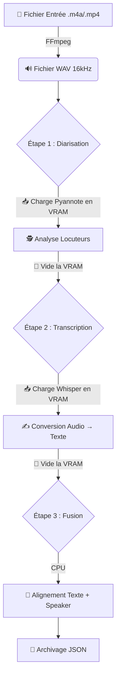

# 🎙️ Smart Meeting Scribe : AI Transcription & Diarization (VRAM Optimized)

Smart Meeting Scribe est une solution d'IA locale ("On-Premise") permettant de transcrire des réunions audio/vidéo tout en identifiant précisément **qui parle** et **quand**.

Contrairement aux solutions cloud, tout tourne sur votre GPU, garantissant une **confidentialité totale** des données. Cette version **V3 Modular** est optimisée pour économiser la mémoire vidéo (VRAM) en chargeant les modèles **séquentiellement**.

---

## ⚙️ Fonctionnement Global (Le Pipeline)

L'application ne charge pas tous les modèles en même temps. Elle fonctionne par **étapes successives** pour laisser le GPU libre entre chaque tâche.



| Étape | Description |
|-------|-------------|
| **Normalisation** | Conversion de tout média en WAV 16kHz Mono via FFmpeg |
| **Diarisation** | Pyannote 3.1 crée une "timeline" des interventions (SPEAKER_00, SPEAKER_01...) |
| **Nettoyage VRAM** | Le modèle de diarisation est **déchargé** pour libérer le GPU |
| **Transcription** | Faster-Whisper Large-v3 extrait le texte brut avec horodatage |
| **Nettoyage VRAM** | Le modèle Whisper est **déchargé** |
| **Fusion** | Algorithme CPU attribuant chaque phrase au locuteur majoritaire sur le segment temporel |

---

## 📂 Structure du Projet

L'architecture suit une logique de **Microservice** avec une séparation claire des responsabilités ("Separation of Concerns").

```bash
.
├── docker-compose.yml       # 🎛️ Orchestrateur : Définit les services et l'accès GPU
├── .env                     # 🔑 Configuration secrète (Token Hugging Face)
├── .dockerignore            # ⚡ Optimisation du build (exclusion des fichiers lourds)
├── README.md                # 📖 Documentation (ce fichier)
│
└── backend-python/          # 🐍 Le Cœur de l'application
    ├── main.py              # 🎮 Point d'entrée API (Routes FastAPI & Orchestration)
    ├── requirements.txt     # 📦 Dépendances Python
    ├── Dockerfile           # 🐳 Image Système (CUDA 12.4 + FFmpeg)
    │
    ├── core/                # ⚙️ Configuration Bas Niveau
    │   ├── config.py        # 🔧 Détection GPU, Paramètres TF32/Float16
    │   └── models.py        # 🧠 Gestionnaire de mémoire (Load/Unload des modèles IA)
    │
    ├── services/            # 🧩 Logique Métier
    │   ├── audio.py         # 🔊 Wrappers FFmpeg (Conversion, Nettoyage)
    │   ├── diarization.py   # 🕵️ Exécution du pipeline Pyannote
    │   ├── fusion.py        # 🔗 Algorithme de mapping (Texte <-> Speaker)
    │   └── storage.py       # 💾 Gestion des dossiers et écriture JSON
    │
    └── recordings/          # 📂 Sortie : Dossier monté contenant les résultats
```

---

## 📋 Pré-requis

### Matériel
- Carte graphique **NVIDIA** (Min 6GB VRAM recommandé)
- Drivers NVIDIA installés sur l'hôte

### Logiciel
- **Docker Desktop** ou **Docker Engine**
- **NVIDIA Container Toolkit** configuré

### Accès Modèles
- Compte [Hugging Face](https://huggingface.co)
- Token d'accès (Read) créé
- ✅ Acceptation des conditions d'utilisation :
  - [Pyannote Segmentation](https://huggingface.co/pyannote/segmentation-3.0)
  - [Pyannote Diarization](https://huggingface.co/pyannote/speaker-diarization-3.1)

---

## 🚀 Installation & Démarrage

### 1. Configuration des secrets

Créez un fichier `.env` à la racine du projet :

```bash
HF_TOKEN=votre_token_hugging_face_ici
```

### 2. Démarrage de la stack

```bash
docker compose up -d --build
```

> ⏳ Le premier démarrage téléchargera l'image CUDA (~3Go) et les modèles IA (~5Go).

### 3. Vérification

Suivez les logs pour voir le chargement initial :

```bash
docker compose logs -f backend-python
```

Vous devriez voir :
```
⚙️ Configuration : NVIDIA GeForce RTX XXXX (cuda)
⚙️ Mode VRAM Économique activé (chargement à la demande)
Application startup complete.
```

---

## 🖥️ Utilisation

L'application s'utilise via l'interface **Swagger** (Documentation interactive) générée par FastAPI.

1. Ouvrez votre navigateur : **[http://localhost:5000/docs](http://localhost:5000/docs)**
2. Utilisez la route `POST /transcribe`
3. Uploadez un fichier audio ou vidéo
4. Cliquez sur **Execute**

### Sortie (Dossier `recordings/`)

Chaque analyse crée un dossier horodaté dans `backend-python/recordings/` contenant **3 fichiers** :

| Fichier | Contenu |
|---------|---------|
| `diarization.json` | La timeline pure des voix (sans texte) |
| `transcription.json` | Le texte pur (sans noms) |
| `fusion.json` | ✅ **Le résultat final combiné** |

### Exemple de `fusion.json`

```json
[
  {
    "start": 0.0,
    "end": 2.5,
    "text": "Bienvenue dans cette réunion.",
    "speaker": "SPEAKER_00"
  },
  {
    "start": 2.8,
    "end": 5.1,
    "text": "Merci, passons au budget.",
    "speaker": "SPEAKER_01"
  }
]
```

---

## 🛠️ Dépannage & Optimisation

### VRAM insuffisante ?

L'application est configurée en mode **"VRAM Saver"**. Elle libère la mémoire entre chaque étape.

Si vous avez une très petite carte (<6GB), modifiez `core/models.py` pour utiliser Whisper `small` ou `medium` :

```python
# Dans core/models.py, ligne 16
current_whisper = WhisperModel("medium", device=DEVICE, compute_type=COMPUTE_TYPE)
```

### Erreur 401/403 Pyannote

- ✅ Vérifiez que votre `HF_TOKEN` est valide dans `.env`
- ✅ Vérifiez que vous avez cliqué sur **"Agree"** sur les pages Hugging Face des modèles Pyannote

### Permission Denied (Linux)

Si le dossier `recordings` est verrouillé (cadenas), c'est que Docker l'a créé en tant que root.

```bash
# Solution :
sudo chown -R $USER:$USER backend-python/recordings
```

---

## 📊 Stack Technique

| Composant | Technologie |
|-----------|-------------|
| **Container** | Docker + NVIDIA Container Toolkit |
| **Base Image** | `nvidia/cuda:12.4.1-runtime-ubuntu22.04` |
| **Backend** | Python 3.10 + FastAPI |
| **Transcription** | Faster-Whisper Large-v3 |
| **Diarisation** | Pyannote Audio 3.1 |
| **Audio** | FFmpeg (conversion WAV 16kHz) |
| **Optimisation GPU** | INT8/FLOAT16 + TF32 |
