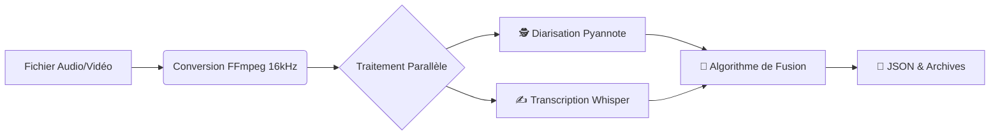

# 🎙️ Smart Meeting Scribe : GPU-Accelerated Diarization & Transcription

Smart Meeting Scribe est une API locale haute performance capable de transcrire des fichiers audio/vidéo tout en identifiant qui parle et quand (Diarisation).

L'application combine la puissance de Faster-Whisper (Large-v3) pour le texte et de Pyannote Audio 3.1 pour l'analyse des locuteurs, le tout orchestré par un algorithme de fusion intelligent.

## 🏗️ Architecture Technique

Le projet suit une philosophie "Clean Host" : l'intégralité de la stack (FFmpeg, Python, CUDA Libraries) tourne dans un conteneur isolé. Votre machine hôte reste propre.

### Le Pipeline Hybride



- **Hôte requis** : Linux (Ubuntu recommandé) + Drivers NVIDIA.
- **Conteneur** : CUDA 12.4.1 (Image officielle NVIDIA).
- **Backend** : Python 3.10, FastAPI.
- **IA** : PyTorch 2.x, calculs optimisés (INT8/FLOAT16 + TF32).

## 📂 Structure du projet

```bash
.
├── docker-compose.yml       # Orchestration & Gestion GPU
├── .env                     # Tokens secrets (Hugging Face)
├── README.md                # Documentation
├── ARCHITECTURE.md          # Détails techniques du pipeline
└── backend-python/          # Microservice IA
    ├── Dockerfile           # Environnement (CUDA 12.4, FFmpeg)
    ├── requirements.txt     # Librairies (Whisper, Pyannote...)
    ├── main.py              # Logique API & Fusion
    └── recordings/          # 📂 Dossier monté : Archives des analyses
```

## 📋 Pré-requis (Sur la machine hôte)

- **NVIDIA Drivers** : Installés sur l'hôte (`nvidia-smi` doit fonctionner).
- **Docker & Docker Compose** : Installés.
- **NVIDIA Container Toolkit** : Configuré pour que Docker puisse voir le GPU.
- **Compte Hugging Face** : Indispensable pour télécharger le modèle Pyannote 3.1.
  - Accepter les conditions d'utilisation sur [cette page](https://huggingface.co/pyannote/speaker-diarization-3.1).
  - Créer un Access Token (Read).

## 🚀 Installation & Démarrage

### 1. Cloner le projet

```bash
git clone <votre-repo>
cd smart-meeting-scribe
```

### 2. Configuration du Token

Créez un fichier `.env` à la racine pour y mettre votre token Hugging Face :

```bash
# Crée le fichier .env
echo "HF_TOKEN=votre_token_hugging_face_ici" > .env
```

### 3. Lancer la Stack

Docker va construire l'image, télécharger les dépendances et démarrer le serveur.

```bash
docker compose up -d --build
```

Le premier lancement peut prendre quelques minutes (téléchargement des modèles IA).

### 4. Vérification

Vérifiez les logs pour confirmer que le GPU, Whisper et Pyannote sont chargés :

```bash
docker compose logs -f backend-python
```

Vous devez voir : `✅ Pipeline chargé !` et `🚀 GPU Détecté.` (Ctrl+C pour quitter les logs)

## 🖥️ Utilisation

L'API expose une interface Swagger UI pour tester facilement.

1. Ouvrez votre navigateur sur : [http://localhost:5000/docs](http://localhost:5000/docs)
2. Allez sur la route `POST /transcribe`.
3. Chargez un fichier audio ou vidéo (mp3, wav, m4a, mp4...).
4. Cliquez sur **Execute**.

### Format de Sortie (JSON)

L'API retourne (et sauvegarde dans `backend-python/recordings/`) un résultat structuré :

```json
{
  "metadata": {
    "filename": "meeting_marketing.m4a",
    "duration": 45.2,
    "saved_at": "recordings/20240104_1530_meeting"
  },
  "segments": [
    {
      "start": 0.0,
      "end": 2.5,
      "text": "Bonjour à tous, commençons.",
      "speaker": "SPEAKER_00"
    },
    {
      "start": 2.8,
      "end": 5.1,
      "text": "Merci d'être présents pour ce point budget.",
      "speaker": "SPEAKER_01"
    }
  ]
}
```

## �️ Dépannage Courant

- **Erreur Permission Denied sur `recordings/`** : Assurez-vous que votre utilisateur Linux a les droits d'écriture sur le dossier ou lancez Docker avec les bonnes permissions UID/GID.

- **Erreur Pyannote (401/403)** : Vérifiez que votre `HF_TOKEN` est valide dans le `.env` et que vous avez bien accepté les conditions sur le site Hugging Face.

- **Mémoire GPU insuffisante** : Whisper Large-v3 + Pyannote nécessitent environ 6 à 8 Go de VRAM. Si vous avez moins, modifiez `main.py` pour utiliser Whisper `medium` ou `small`.
