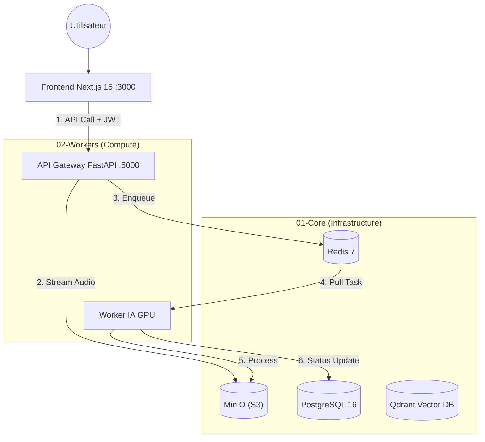

# Architecture Technique - Smart Meeting Scribe (V5)

> ⚠️ **STABLE ALPHA**
> Ce projet est passé d'un monolithe à une architecture multi-stacks distribuée.
> *Version actuelle : v5.0.0-gold*

> 🤖 **IA - Application réunion** | *Gem personnalisé*

---

> 🚀 **VERSION V5 - Architecture S3-Native & Multi-Utilisateurs**
> Solution **Enterprise-Grade** d'analyse de réunions **100% On-Premise**.
>
> Stack : **Next.js 15** • **FastAPI** • **PostgreSQL 16** • **MinIO (S3)** • **Redis 7** • **Whisper**

---

## 🎯 Vision & Philosophie

**Smart Meeting Scribe** sécurise et automatise la transcription de réunions grâce à une architecture robuste où chaque service est isolé.

### Piliers de l'Architecture V5

| Pilier | Description |
|--------|-------------|
| � **Sécurité JWT** | Authentification complète des utilisateurs. Hachage Bcrypt et protection des routes par jetons de session. |
| 🪣 **Stockage Objet (S3)** | Migration vers MinIO. Les fichiers audio et résultats ne dépendent plus du système de fichiers local du conteneur. |
| ⚡ **Clean Architecture** | Backend API structuré en couches (Endpoints ➔ Services ➔ Modèles) pour une maintenance facilitée. |
| 🎮 **GPU Safety (VRAM)** | Stratégie Single Model Residency pour faire tourner Whisper Large-v3 et Pyannote sur 12GB de VRAM. |

---

## 🏗️ Architecture Système (Multi-Stacks)

L'application est orchestrée en trois blocs indépendants pour garantir la haute disponibilité des services de base.

### Vue d'ensemble des Flux



### Composants Techniques

| Service | Technologie | Rôle |
|---------|-------------|------|
| **Frontend** | Next.js 15 | Interface utilisateur réactive (React 19, Tailwind). |
| **API** | FastAPI | Gateway. Gestion Auth, Upload direct vers S3, orchestration DB. |
| **Worker** | Taskiq + Python | Pipeline IA : Diarisation, Transcription, Identification. |
| **Database** | PostgreSQL 16 | Persistance des utilisateurs, métadonnées des meetings et statuts. |
| **Object Storage** | MinIO | Stockage compatible S3 pour l'audio et les fichiers JSON de sortie. |
| **Vector DB** | Qdrant | Base vectorielle pour les futurs services de RAG (Chat avec documents). |

---

## 🔄 Pipeline de Traitement (Workflow V5)

1. **Ingestion (API)** : L'audio est streamé vers MinIO. Une entrée est créée dans Postgres (Statut `PENDING`).

2. **Orchestration** : Une tâche est publiée dans Redis.

3. **Inférence (Worker)** :
   - Prise en charge ➔ Statut `PROCESSING`.
   - Pipeline séquentiel (Conversion ➔ Diarisation ➔ Transcription ➔ Fusion).
   - Sauvegarde des résultats JSON sur MinIO.

4. **Finalisation** : Mise à jour Postgres ➔ Statut `COMPLETED`.

---

## 📂 Structure du Projet

```bash
smart-meeting-scribe/
├── 01-core/                 # Infrastructure de base (DB, Redis, S3, Qdrant)
├── 02-workers/              # Worker IA (Pipeline Whisper/Pyannote)
│   ├── app/                 # Code métier IA
│   └── Dockerfile           # Image Cuda 12.4
├── 03-interface/            # Application Web
│   ├── backend/             # API FastAPI (Clean Architecture)
│   │   └── app/
│   │       ├── api/         # Routes v1 (Auth, Transcribe)
│   │       ├── core/        # Sécurité & JWT
│   │       ├── models/      # Tables SQLAlchemy (User, Meeting)
│   │       └── services/    # Logique S3 & Taskiq
│   └── frontend/            # Next.js 15 App
├── manage.sh                # 🛠️ Script Master (Clean & Start)
└── volumes/                 # Persistance locale des données
```

---

## 🚀 Installation & Démarrage

### Pré-requis

- **Docker** & **Docker Compose**
- **NVIDIA Container Toolkit** (pour le GPU)
- Fichier `.env` configuré à la racine

### Commande Unique

Le projet utilise un script d'automatisation qui nettoie, build et lance toutes les stacks :

```bash
./manage.sh
```

---

## 💾 Gestion des Données (Volumes)

Les données sont centralisées dans le dossier `/volumes` pour une portabilité totale :

| Volume | Description |
|--------|-------------|
| `postgres_data` | Tables SQL des utilisateurs et historique des réunions. |
| `minio_data` | Contenu brut du stockage S3 (audio et transcriptions). |
| `huggingface_cache` | Poids des modèles IA téléchargés (Whisper/Pyannote). |
| `qdrant_storage` | Index vectoriels pour la recherche sémantique. |

---

## ⚡ Optimisation VRAM & Performance

Le système est conçu pour tourner sur une **RTX 4070 Ti (12GB)** :

- **Single Model Residency** : Un seul modèle IA chargé à la fois en VRAM.
- **Async Streaming** : L'API FastAPI streame les fichiers vers MinIO sans bufferisation mémoire excessive.
- **PostgreSQL 16** : Optimisé pour les requêtes asynchrones via `asyncpg`.

---

## 📋 Roadmap V5+

- [ ] Interface de Dashboard Next.js 15 sécurisée.
- [ ] RAG (Retrieval Augmented Generation) : Chat avec vos réunions.
- [ ] Export Word/PDF automatisé des comptes-rendus.

---

*Dernière mise à jour : 12 Janvier 2026*
