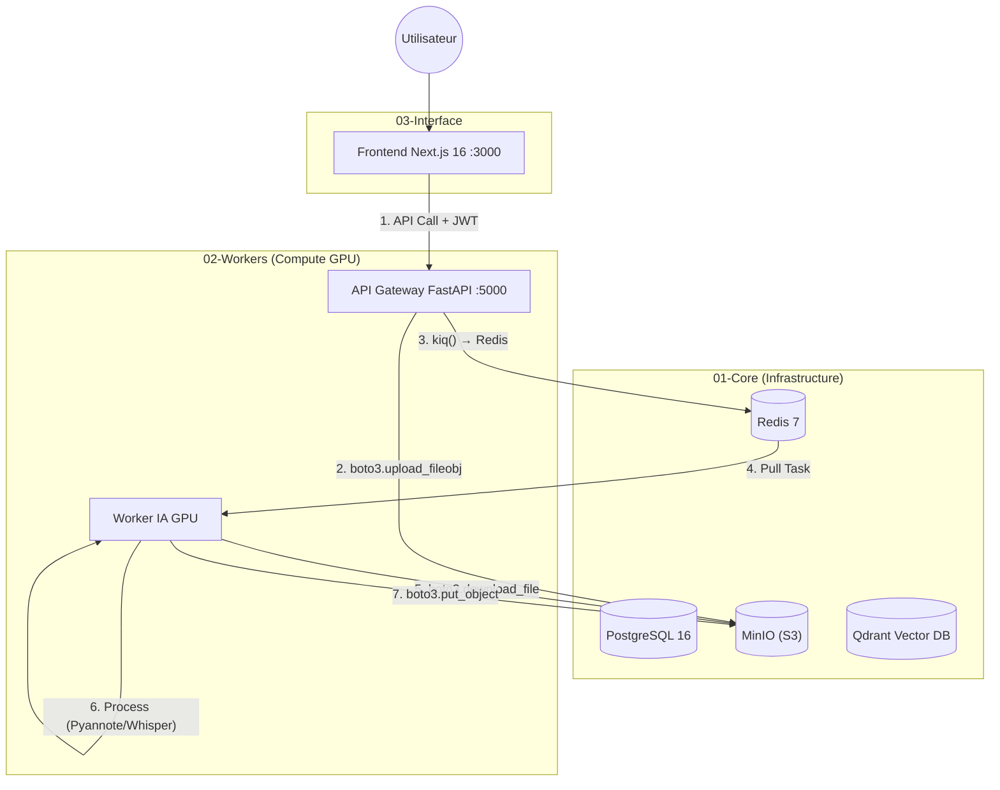

# Smart Meeting Scribe (V5.1)

> ⚠️ **STABLE ALPHA**
> Architecture multi-stacks distribuée avec stockage S3-Native (boto3).
> *Version actuelle : v5.1.0*

> 🤖 **IA - Application réunion** | *Gem personnalisé*

---

> 🚀 **VERSION V5.1 - Architecture S3-Native & Boto3**
> Solution **Enterprise-Grade** d'analyse de réunions **100% On-Premise**.
>
> Stack : **Next.js 16** • **FastAPI** • **PostgreSQL 16** • **MinIO (S3)** • **Redis 7** • **Whisper** • **boto3**

---

## 🎯 Vision & Philosophie

**Smart Meeting Scribe** sécurise et automatise la transcription de réunions grâce à une architecture robuste où chaque service est isolé.

### Piliers de l'Architecture V5.1

| Pilier | Description |
|--------|-------------|
| 🔐 **Sécurité JWT** | Authentification complète des utilisateurs. Hachage Bcrypt et protection des routes par jetons de session. |
| 🪣 **Stockage S3 (boto3)** | Communication unifiée via **boto3** vers MinIO. Streaming direct sans stockage intermédiaire. |
| ⚡ **Clean Architecture** | Backend API structuré en couches (Endpoints ➔ Services ➔ Modèles) pour une maintenance facilitée. |
| 🎮 **GPU Safety (VRAM)** | Stratégie Single Model Residency pour faire tourner Whisper Large-v3-Turbo et Pyannote sur 12GB de VRAM. |
| 🎯 **Speaker ID** | Identification des locuteurs via WeSpeaker et banque de voix. |

---

## 🏗️ Architecture Système (Multi-Stacks)

L'application est orchestrée en trois blocs indépendants pour garantir la haute disponibilité des services de base.

### Vue d'ensemble des Flux



### Composants Techniques

| Service | Technologie | Rôle |
|---------|-------------|------|
| **Frontend** | Next.js 16 (Standalone) | Interface utilisateur (Docker optimisé ~100MB). |
| **API** | FastAPI + boto3 | Gateway. Auth, Upload stream vers S3, dispatch Redis. |
| **Worker** | Taskiq + Python + CUDA | Pipeline IA : Diarisation, Identification, Transcription. |
| **Database** | PostgreSQL 16 | Persistance des utilisateurs et métadonnées. |
| **Object Storage** | MinIO | Stockage compatible S3 pour audio et résultats JSON. |
| **Message Broker** | Redis 7 | File d'attente des tâches de transcription. |
| **Vector DB** | Qdrant | Base vectorielle pour le futur RAG. |

---

## 🔄 Pipeline de Traitement

```
📥 Upload (API)           → boto3.upload_fileobj() → s3://uploads/
📨 Dispatch               → Redis (taskiq.kiq)
⬇️ Download (Worker)      → boto3.download_file() → /tmp/
🎵 Conversion             → FFmpeg → WAV 16kHz
👥 Diarisation            → Pyannote 3.1 (GPU)
🎯 Identification         → WeSpeaker + Voice Bank
✍️ Transcription          → Whisper Large-v3-Turbo (GPU)
🔗 Fusion                 → JSON structuré par speaker
💾 Upload Résultats       → boto3.put_object() → s3://processed/
🧹 Cleanup                → Fichiers temp supprimés
```

---

## 📂 Structure du Projet

```bash
smart-meeting-scribe/
├── 01-core/                 # Infrastructure (DB, Redis, S3, Qdrant, TEI)
│   └── docker-compose.yml
├── 02-workers/              # Worker IA (Pipeline GPU)
│   ├── app/
│   │   ├── worker/tasks.py  # Pipeline principal (boto3)
│   │   ├── services/        # Audio, Diarization, Transcription, Storage
│   │   └── core/models.py   # Gestion VRAM
│   ├── voice_bank/          # Signatures vocales (.wav)
│   └── Dockerfile           # CUDA 12.4 + Python
├── 03-interface/            # Application Web
│   ├── backend/             # API FastAPI
│   │   └── app/
│   │       ├── api/v1/      # Routes (Auth, Process)
│   │       ├── broker.py    # Taskiq Redis
│   │       └── core/        # Config, Sécurité JWT
│   └── frontend-nextjs/     # Next.js 16 (Standalone Docker)
├── volumes/                 # Persistance locale
├── .env                     # Variables d'environnement
└── manage.sh                # 🛠️ Script Master
```

---

## 🚀 Installation & Démarrage

### Pré-requis

- **Docker** & **Docker Compose**
- **NVIDIA Container Toolkit** (GPU)
- Fichier `.env` configuré à la racine

### Commande Unique

```bash
./manage.sh
```

Ce script :
1. Nettoie les anciens containers
2. Lance 01-core (infra)
3. Lance 02-workers (GPU)
4. Lance 03-interface (API + Frontend)

### Accès

| Service | URL |
|---------|-----|
| Frontend | http://localhost:3000 |
| API Docs | http://localhost:5000/docs |
| MinIO Console | http://localhost:9001 |

---

## 💾 Gestion des Données

| Volume | Description |
|--------|-------------|
| `postgres_data` | Tables SQL (Users, Meetings). |
| `minio_data` | Stockage S3 (audio + transcriptions). |
| `huggingface_cache` | Modèles IA (Whisper, Pyannote, WeSpeaker). |
| `qdrant_storage` | Index vectoriels (RAG futur). |

---

## ⚡ Optimisation VRAM & Performance

Système conçu pour **RTX 4070 Ti (12GB)** :

| Stratégie | Description |
|-----------|-------------|
| **Single Model Residency** | Un seul modèle chargé en VRAM à la fois. |
| **boto3 Streaming** | Upload/Download S3 sans bufferisation mémoire. |
| **Garbage Collection** | `release_models()` après chaque étape GPU. |
| **Async PostgreSQL** | Requêtes non-bloquantes via `asyncpg`. |

---

## 📋 Roadmap

- [x] Migration fsspec → boto3
- [x] Frontend Next.js 16 (Standalone Docker)
- [ ] Dashboard utilisateur sécurisé
- [ ] RAG : Chat avec vos réunions (Qdrant + LLM)
- [ ] Export Word/PDF automatisé

---

*Dernière mise à jour : 15 Janvier 2026*
