# 🎙️ Smart Meeting Scribe : AI Transcription & Diarization (VRAM Optimized)

Smart Meeting Scribe est une solution d'IA locale ("On-Premise") permettant de transcrire des réunions audio/vidéo tout en identifiant précisément qui parle par son nom grâce à la reconnaissance biométrique vocale.

Cette version V4 "Identification" est optimisée pour économiser la mémoire vidéo (VRAM) en utilisant une stratégie de chargement séquentiel des modèles.

## ⚙️ Fonctionnement Global (Le Pipeline)

L'application fonctionne par étapes successives (Pipeline Séquentiel) pour garantir qu'un seul modèle IA occupe le GPU à un instant T.

```mermaid
graph TD
    A[📁 Fichier Entrée .m4a/.mp4] -->|FFmpeg| B(🔊 Fichier WAV 16kHz)
    
    B --> C{Étape 1 : Diarisation}
    C -->|"📥 Charge Pyannote"| D[🕵️ Segmentation des locuteurs]
    D -->|"🧹 Vide VRAM"| E{Étape 2 : Identification}
    
    E -->|"📥 Charge WeSpeaker"| F[👤 Comparaison avec Voice Bank]
    F -->|"🧹 Vide VRAM"| G{Étape 3 : Transcription}
    
    G -->|"📥 Charge Whisper"| H[✍️ Conversion Audio → Texte]
    H -->|"🧹 Vide VRAM"| I{Étape 4 : Fusion}
    
    I -->|CPU| J[🧩 Alignement Texte + Noms Réels]
    J --> K[💾 Archivage JSON]
```



| Étape | Modèle / Outil | Description |
|-------|----------------|-------------|
| Normalisation | FFmpeg | Conversion en WAV 16kHz Mono (Standard Or pour l'IA). |
| Diarisation | Pyannote 3.1 | Sépare les flux de paroles (SPEAKER_00, SPEAKER_01...). |
| Identification | WeSpeaker | Compare les voix détectées avec les fichiers du dossier `voice_bank/`. |
| Transcription | Whisper Large-v3 | Extrait le texte haute précision via Faster-Whisper. |
| Fusion | Algorithme CPU | Attribue les noms réels aux phrases dans le JSON final. |

## � La "Voice Bank" (Reconnaissance Vocale)

Pour que l'IA puisse dire "Julien" au lieu de "SPEAKER_01", vous devez lui fournir des références.

1. Créez des fichiers audio courts (10-15s) de chaque personne.
2. Placez-les dans `backend-python/voice_bank/`.
3. Nommez les fichiers par le nom de la personne (ex: `Julien.wav`, `Sarah.wav`).

L'IA calculera automatiquement une empreinte mathématique (Embedding) pour chaque fichier et l'utilisera pour identifier les participants lors de la fusion.

## 📂 Structure du Projet

```bash
.
├── docker-compose.yml       
├── .env                     # Token Hugging Face
└── backend-python/          
    ├── main.py              # Orchestrateur (FastAPI)
    ├── core/                
    │   ├── config.py        # Paramètres GPU
    │   └── models.py        # Gestionnaire de VRAM (Load/Unload)
    ├── services/            
    │   ├── audio.py         # FFmpeg
    │   ├── diarization.py   # Pyannote
    │   ├── identification.py # 🆕 Reconnaissance (WeSpeaker + Cosine Similarity)
    │   ├── transcription.py # Whisper
    │   └── fusion.py        # Mapping Texte <-> Noms
    ├── voice_bank/          # 🆕 Dossier des voix de référence (.wav)
    └── recordings/          # Résultats (JSON)
```

## 🚀 Installation & Démarrage

### 1. Configuration des secrets (.env)

```bash
HF_TOKEN=votre_token_hugging_face_ici
```

### 2. Démarrage

```bash
docker compose up -d --build
```

### 3. Vérification des logs

```bash
docker compose logs -f backend-python
```

Lors de l'analyse, vous devriez voir :

```
🔍 [2/4] Identification des locuteurs...
   👤 Signature vocale enregistrée pour : Homme
   � Signature vocale enregistrée pour : Femme
      ✨ SPEAKER_01 identifié comme : Homme (Score: 0.99)
```

## �️ Stack Technique

| Composant | Technologie |
|-----------|-------------|
| Container | Docker + NVIDIA Container Toolkit |
| Base Image | nvidia/cuda:12.4.1-runtime-ubuntu22.04 |
| Backend | Python 3.10 + FastAPI |
| Transcription | Faster-Whisper Large-v3 (INT8/FP16) |
| Diarisation | Pyannote Audio 3.1 |
| Identification | WeSpeaker (ResNet34 VoxCeleb) |
| Mathématiques | NumPy / SciPy (Distance Cosinus) |

## 📋 Pré-requis Hugging Face

✅ Vous devez accepter les conditions d'utilisation pour :

- [Pyannote Segmentation 3.0](https://huggingface.co/pyannote/segmentation-3.0)
- [Pyannote Speaker Diarization 3.1](https://huggingface.co/pyannote/speaker-diarization-3.1)
- [WeSpeaker VoxCeleb](https://huggingface.co/pyannote/wespeaker-voxceleb-resnet34-LM)
