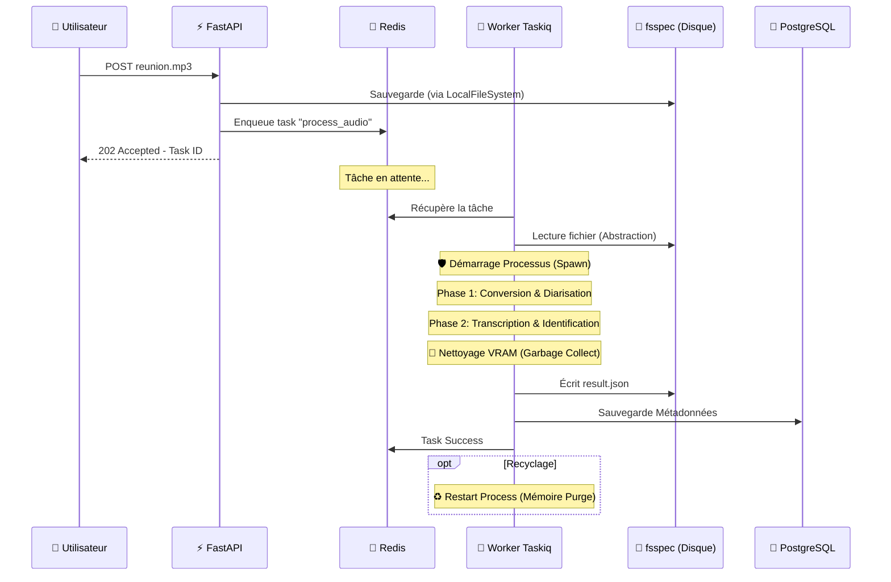
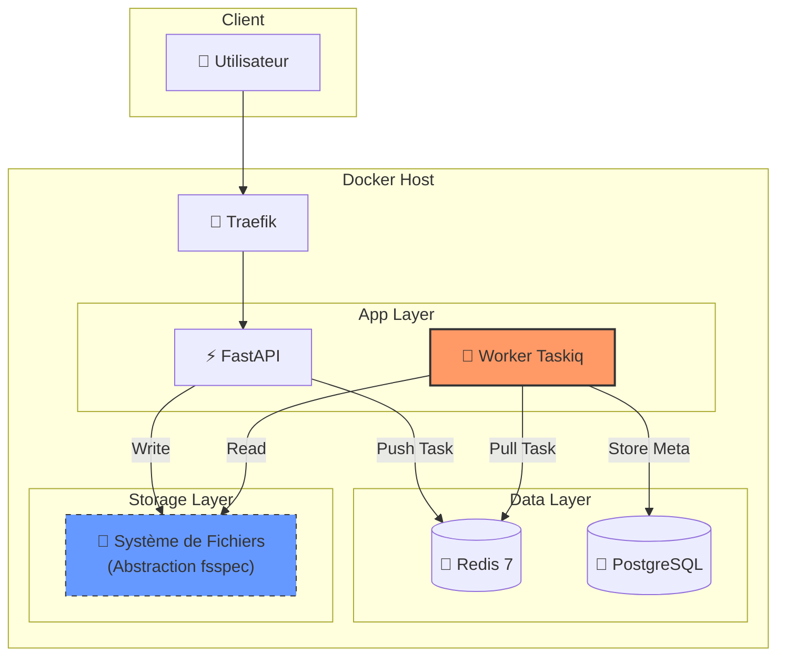

# 🏗️ Architecture Technique : Smart Meeting Scribe V3.1

- **Version** : 3.1 (Stack "Safe & Lean")
- **Approche** : "Clean Host", "AI Native" & "Cloud Ready"
- **Cible** : Déploiement On-Premise (Docker) sur GPU unique (Consumer Grade - ex: RTX 4070)

Ce document sert de référence pour comprendre les choix technologiques, la gestion des flux de données et la stratégie de performance GPU validée par l'audit 2026.

---

## 1. Vue d'Ensemble & Philosophie

Le passage à la V3.1 corrige les défauts de maintenance des files d'attente historiques et prépare le système à la scalabilité sans complexité inutile au démarrage.

### Les 3 Piliers de l'Architecture

| Pilier | Description |
|--------|-------------|
| **Découplage "Async-Native"** | L'API délègue le travail via une stack asynchrone moderne (Taskiq) qui partage l'injection de dépendances avec FastAPI. Plus de "hacks" pour faire parler le Web et le Worker. |
| **Stockage Abstrait (fsspec)** | Plutôt que de lier le code à un disque dur ou à AWS S3, nous utilisons une abstraction. Le code lit `protocol://file.wav`. Aujourd'hui c'est le disque NVMe (Rapide), demain c'est MinIO/S3 (Scalable), sans changer une ligne de code. |
| **Sécurité GPU "Defensive"** | Le système utilise le mode Spawn strict et le Recyclage des Workers pour contrer les fuites de mémoire et les instabilités des drivers CUDA. |

---

## 2. La Stack Technologique (Détail)

### 🌐 Couche Infrastructure & Réseau

| Composant | Rôle |
|-----------|------|
| **Docker Compose** | Orchestrateur unique. Tout le système démarre avec une seule commande. |
| **Traefik (Reverse Proxy)** | Porte d'entrée unique (Port 80). Route le trafic et gérera le SSL. |

### ⚡ Couche Application (Backend)

| Composant | Rôle | Performance |
|-----------|------|-------------|
| **FastAPI (Python)** | Guichetier. Reçoit le fichier, utilise fsspec pour le stocker, et pousse la tâche dans Redis. | Temps de réponse < 200ms |
| **Taskiq (Orchestrateur)** | Remplaçant validé d'ARQ/Celery. Intégration native avec FastAPI, typage strict, et support robuste des middlewares. | — |

> [!TIP]
> **Pourquoi Taskiq ?**
> ARQ est en maintenance et Celery gère mal l'async moderne. Taskiq est le standard pour FastAPI, permettant de partager la connexion DB et la configuration entre l'API et le Worker.

### 🧠 Couche Intelligence (Worker IA)

Le "Cerveau" du système. Isolé dans son propre processus (Spawn Mode).

| Modèle | Fonction | Notes |
|--------|----------|-------|
| **Faster-Whisper** | Transcription audio → texte | Engine CTranslate2 (4x plus rapide que OpenAI) |
| **Pyannote Audio 3.1** | Diarisation ("Qui parle quand ?") | Exécuté sur GPU avec gestion stricte de la mémoire |
| **WeSpeaker** | Identification biométrique | Comparaison vectorielle |

### 💾 Couche Données & Stockage

| Composant | Rôle |
|-----------|------|
| **Redis 7 (Alpine)** | Broker & Backend : Gère la file d'attente Taskiq et stocke les résultats temporaires. |
| **PostgreSQL 15** | Mémoire à long terme (Utilisateurs, Métadonnées, Indexation). |
| **fsspec (Abstraction)** | **Couche Logique** : Interface unique pour les fichiers. • **Phase 1 (Actuelle)** : Backend LocalFileSystem (Performance NVMe). • **Phase 2 (Future)** : Backend S3FileSystem (MinIO). |

---

## 3. Flux de Données (Workflow)

Voici le trajet exact d'une réunion avec la nouvelle abstraction.

### Étapes Clés V3.1

1. **Ingestion (FastAPI + fsspec)**
   - FastAPI reçoit le stream.
   - Il écrit via fsspec (agnostique du support physique).
   - Il envoie le message à Redis via le broker Taskiq.

2. **Traitement (Worker Taskiq)**
   - Le Worker récupère le message.
   - **Sécurité** : Il lance le traitement dans un contexte isolé.
   - Il exécute le pipeline IA (Whisper/Pyannote).

3. **Finalisation & Recyclage**
   - Les résultats sont sauvegardés.
   - **Auto-Nettoyage** : Après N tâches (ex: 50), le processus worker redémarre automatiquement pour garantir qu'aucune fuite de mémoire CUDA ne persiste.

---

## 4. Stratégie de Gestion GPU (VRAM)

> [!CAUTION]
> Point critique validé par l'audit pour la stabilité long terme.

### Protocole de Sécurité CUDA

| Règle | Implémentation V3.1 |
|-------|---------------------|
| **Spawn Context** | Utilisation forcée de `multiprocessing.set_start_method('spawn')`. Empêche les crashs liés au fork des drivers NVIDIA. |
| **Concurrency = 1** | `max_async_tasks=1`. Une seule réunion à la fois par GPU. |
| **Worker Recycling** | Le worker se suicide et renaît périodiquement pour vider la fragmentation mémoire. |
| **Imports Explicites** | Pas d'auto-découverte "magique" des tâches (source de bugs avec le recyclage). Tout est importé explicitement. |

---

## 5. Évolutions Futures (Ready)

L'architecture V3.1 prépare le terrain pour la scalabilité sans dette technique.

### 🔮 Roadmap Technique

| Feature | Impact V3.1 |
|---------|-------------|
| **Passage Cluster** | Grâce à fsspec, basculer sur MinIO (S3) se fait en changeant 1 variable d'environnement (`STORAGE_PROTOCOL=s3`). Le code ne change pas. |
| **RAG (Vector Search)** | L'intégration de Qdrant est triviale car Taskiq peut facilement lancer des sous-tâches d'embedding (BGE-M3) après la transcription. |
| **Frontend Realtime** | Redis est déjà configuré pour le Pub/Sub. On pourra streamer la progression (SSE) directement au Frontend Next.js. |

---

## 📊 Diagramme d'Architecture Globale

---

*Document mis à jour le 10 janvier 2026 - Validation Audit V3.1*
