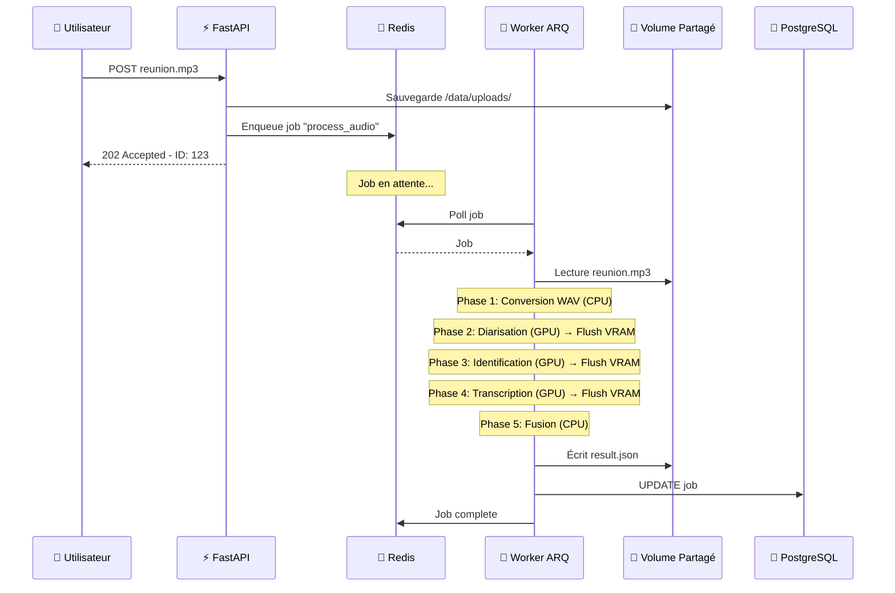
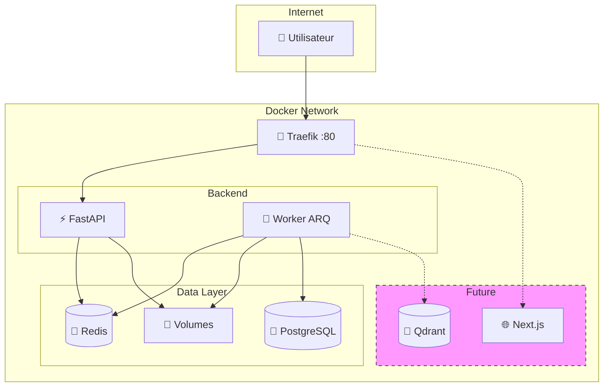

# 🏗️ Architecture Technique : Smart Meeting Scribe V2.5

> **Version** : 2.5 (Architecture Asynchrone Optimisée)  
> **Approche** : "Clean Host" & "AI Native"  
> **Cible** : Déploiement On-Premise (Docker) sur GPU unique (Consumer Grade - ex: RTX 4070)

Ce document sert de référence pour comprendre les choix technologiques, la gestion des flux de données et la stratégie de performance GPU.

---

## 1. Vue d'Ensemble & Philosophie

Le passage de la **V1** (Script Monolithique) à la **V2.5** vise à transformer un outil de script en une véritable **plateforme SaaS interne robuste**.

### Les 3 Piliers de l'Architecture

| Pilier | Description |
|--------|-------------|
| **Découplage Total** | L'API qui reçoit les fichiers n'est jamais celle qui les traite. Cela garantit que l'interface utilisateur reste fluide, même si le serveur calcule depuis 2 heures. |
| **Zero-Copy Storage** | Contrairement aux architectures Cloud complexes (S3/MinIO), nous profitons d'être sur un serveur unique pour utiliser des **Volumes Partagés**. L'API écrit sur le disque, le Worker lit sur le même disque. Latence : **0ms**. |
| **Discipline VRAM Stricte** | Le système est conçu pour ne jamais planter par manque de mémoire vidéo. Les tâches sont sérialisées (une par une) et la mémoire est purgée après chaque étape. |

---

## 2. La Stack Technologique (Détail)

### 🌐 Couche Infrastructure & Réseau

| Composant | Rôle |
|-----------|------|
| **Docker Compose** | Orchestrateur unique. Tout le système démarre avec une seule commande. L'hôte n'a besoin que de Docker et des Drivers NVIDIA. |
| **Traefik** (Reverse Proxy) | Porte d'entrée unique (Port 80). Route le trafic : `/api` → Backend, `/` → Frontend (futur Next.js). Gère le Load Balancing et la sécurité SSL (futur). |

### ⚡ Couche Application (Backend)

| Composant | Rôle | Performance |
|-----------|------|-------------|
| **FastAPI** (Python) | *Guichetier*. Reçoit le fichier, vérifie l'auth, le pose sur le disque, et crée un ticket dans Redis. | Temps de réponse < 200ms |
| **ARQ** (Job Queue) | Remplaçant moderne de Celery. Conçu pour `asyncio` (standard Python moderne). Plus léger, démarre plus vite, gère mieux les processus GPU sans "zombies". | — |

> [!TIP]
> **Pourquoi ARQ plutôt que Celery ?**  
> Celery est vieux et lourd. ARQ est natif `asyncio`, s'intègre parfaitement avec FastAPI, et ne laisse pas de processus orphelins lors des longues tâches GPU.

### 🧠 Couche Intelligence (Worker IA)

Le "Cerveau" du système. **Isolé dans son propre conteneur Docker.**

| Modèle | Fonction | Notes |
|--------|----------|-------|
| **Faster-Whisper** (Large-v3) | Transcription audio → texte | Version optimisée (CTranslate2), **4x plus rapide** que le Whisper original d'OpenAI |
| **Pyannote Audio 3.1** | Diarisation ("Qui parle quand ?") | Module le plus gourmand, exécuté en priorité |
| **WeSpeaker** (VoxCeleb) | Identification biométrique | Compare la voix aux embeddings de `voice_bank/` |

### 💾 Couche Données (Persistence)

| Composant | Rôle |
|-----------|------|
| **Redis 7** (Alpine) | **Broker** : File d'attente des tâches. **Cache** : État des jobs ("En cours", "Fini"). |
| **PostgreSQL 15** (Alpine) | Mémoire à long terme. Stocke utilisateurs, historique des réunions, métadonnées (durée, locuteurs), liens vers fichiers. |
| **Docker Shared Volumes** | Stockage physique des fichiers `.mp3`, `.wav` et résultats `.json`. Remplace MinIO. Accès disque direct (NVMe), pas de réseau. |

---

## 3. Flux de Données (Workflow)

Voici le trajet exact d'une réunion, de l'upload à la lecture.



### Étapes Détaillées

1. **Ingestion (API)**
   - L'utilisateur envoie `reunion.mp3`
   - FastAPI sauvegarde dans `/data/uploads/` (Volume partagé)
   - FastAPI envoie l'ordre `process_audio` à Redis
   - FastAPI répond `"OK, ID = 123"` à l'utilisateur

2. **Mise en File (Redis)**
   - Le job attend dans la RAM de Redis
   - Si 10 jobs arrivent, ils s'alignent (FIFO)

3. **Traitement (Worker ARQ)**
   - Le Worker (qui surveille Redis) voit le job
   - Il lit directement le fichier dans `/data/uploads/`
   - **Phase 1** : Conversion WAV (CPU)
   - **Phase 2** : Diarisation (GPU - Pyannote) → `Flush VRAM`
   - **Phase 3** : Identification (GPU - WeSpeaker) → `Flush VRAM`
   - **Phase 4** : Transcription (GPU - Whisper) → `Flush VRAM`
   - **Phase 5** : Fusion des données (CPU)

4. **Stockage & Restitution**
   - Le Worker écrit le JSON final dans `/data/results/`
   - Le Worker notifie PostgreSQL que le job #123 est "Terminé"

---

## 4. Stratégie de Gestion GPU (VRAM)

> [!CAUTION]
> C'est le point critique pour la stabilité du système.

### Règles Fondamentales

| Règle | Implémentation |
|-------|----------------|
| **Concurrency = 1** | Le Worker traite strictement **une seule tâche** à la fois |
| **Load / Unload** | Les modèles ne restent pas chargés en mémoire |
| **Protection Async** | Pendant le calcul GPU, le CPU envoie des heartbeats à Redis |

### Cycle de Vie des Modèles

```
┌─────────────────────────────────────────────────────────────┐
│  1. Charger Whisper en VRAM                                 │
│  2. Exécuter l'inférence (transcription)                    │
│  3. Supprimer l'objet Python (del model)                    │
│  4. Appeler gc.collect()                                    │
│  5. Vider le cache CUDA (torch.cuda.empty_cache())          │
│  6. → VRAM libre pour le modèle suivant                     │
└─────────────────────────────────────────────────────────────┘
```

> [!NOTE]
> Cette stratégie permet de faire tourner des modèles énormes (Large-v3 : ~6GB) sur des cartes modestes (8GB VRAM) sans erreur OOM.

---

## 5. Évolutions Futures (Architecture Prête)

Cette architecture V2.5 est conçue pour accueillir les briques suivantes **sans tout casser** :

### 🔮 Roadmap

| Feature | Composant | Statut |
|---------|-----------|--------|
| **RAG** (Retrieval Augmented Generation) | Qdrant + BGE-M3 | 🟡 Prévu |
| **Anonymisation GDPR** | GLiNER (NER léger) | 🟡 Prévu |
| **Frontend Web** | Next.js | 🟡 Prévu |

### RAG (Retrieval Augmented Generation)

- Le conteneur **Qdrant** est déjà prévu dans le réseau Docker
- Le Worker pourra générer des vecteurs (via **BGE-M3**) et les pousser dans Qdrant après la transcription
- Permettra de "questionner" les réunions passées

### Anonymisation (GDPR)

- Intégration prévue de **GLiNER** (CPU/GPU léger)
- S'exécutera juste après la transcription
- Remplacera les noms propres avant stockage définitif

### Frontend Next.js

- Il suffira d'ajouter le conteneur `frontend` dans `docker-compose.yml`
- Traefik fera le lien automatiquement vers `/`

---

## 📊 Diagramme d'Architecture Globale



---

*Document mis à jour le 10 janvier 2026*
